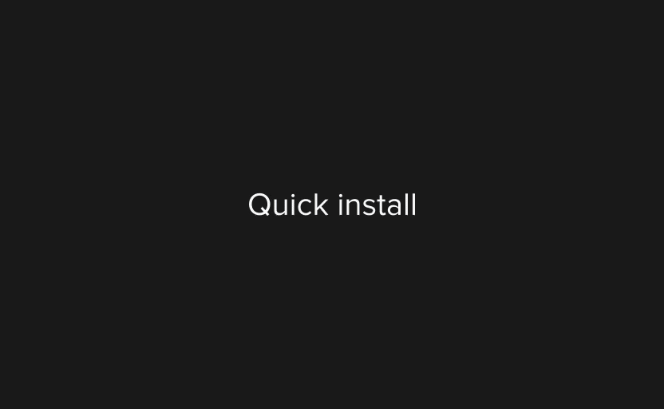

# Javascript ES6 Gulp Init Package for Prototyping

An init package *(you could view it as an boilerplate, but that would be an over-simplification)* to get you up and running **fast** with a clean environment to prototype with javascript.

It's meant to build simple code / figuring out how things work as opposed to building web applications (although it features a web server for all your in-browser needs).

## Show



## Tell

Features:
- ES6 Syntax transpiling w/ [stage-0](https://babeljs.io/docs/plugins/preset-stage-0/)
- Automatic .js file injection into .html (browser mode)
- Permissive of minified .js files (eg: external libraries brought in)
- Local web server w/ auto-reloading
- File bundling (terminal mode)
- Watching files for changes
- Run the files in the terminal (via node.js) w/ auto-reloading

## Quick start

### Automatically via NPM

Create a new folder and enter it:
```bash
mkdir <your-new-project-folder>
cd <your-new-project-folder>
```

Install the node package *(it will trigger all the additional scripts automatically, and set up everything for you)*:
```bash
npm i es6g-init
```
Or you can **run this in one line**:
```bash
mkdir <your-new-project-folder> && cd <your-new-project-folder> && npm i es6g-init
```

### Manual via this repository

Clone the repository into a new folder (your new project's folder):
```bash
git clone git@github.com:rdig/a1w-init.git <your-new-project-folder>
```

Enter your new folder:
```bash
cd <your-new-project-folder>
```

Just run the npm install script which will set up the project for you
```bash
npm install
```

## How to use

Start writing `Javascript` in a `.js` file and it will figure out what you want to do and include your files for your.

In any mode you start it [terminal](#run-modes) or [browser](#run-modes), it will look in the `source` folder for any `.js` script (including minified `.min.js` files) and include them.

Minified files always are included first since we assume they are external libraries.

In [terminal mode](#run-modes) our `.js` files are traspiled (except the minified ones), all of them bundled into a single one, moved into the `build` folder, then the bundle is will be run inside the console, with a file watcher that listens for changes.

In [browser mode](#run-modes) all your `.js` files are inserted into the `index.html` file's designated comment block (find out [more](##sample-files)), the `.js` files are transpiled, then all of them (`.js`, `.min.js`, `.html`) are moved into the `build` folder. A web server is spawned for that folder with an auto-reload / file watcher listening for changes.

## Run Modes

- *Terminal* - Start development in the current terminal window. In will be refreshed anythime it detects a file change on any `.js` files.

- *Browser* - Starts developemnt using a local web server. Open `http://localhost:8080` in your browser. It will auto-reload every time it detects a change in a `.js` or `.html` file.

## NPM commands

To run the tasks use `NPM`'s `run` command:
```bash
npm run <task_name>
```

These are the available tasks you can use:

- `terminal`: Start local development development in [terminal mode](#run-modes).
- `term`: Same as `terminal`.
- `browser`: Start development in [browser mode](#run-modes).
- `http`: Same as `browser`.

There is also a shorter command, `npm start` which defaults to starting development in [terminal mode](#run-modes).

## Sample files

The project is delivered by default with an `index.html` and `app.js` so you could verify that everything is working as it should. These should run in both terminal and browser modes.

Make note of the comment blocks inside of `index.html`.

```html
<!-- inject:js -->
<!-- endinject -->
```

These serve as anchors for `gulp-inject` to link to your created `.js` files. If you want to know more about them heve a look at [github.com/klei/gulp-inject#optionsstarttag](https://github.com/klei/gulp-inject#optionsstarttag).

## Tech stack

### Node.js

A javascript runtime built on chrome's engine (like you didn't already know what node is...).

More Info: [github.com/nodejs/node](https://github.com/nodejs/node)

### Gulp

Task runner and orchestrator (well, there's npm...) of various services (transpiling, http server, file watcher, ...).

More info: [gulpjs.com](http://gulpjs.com/)

There are also a number of other packages (gulp plugins) used for various task:
- **gulp-babel** - a Gulp plugin for Babel. More info [github.com/babel/gulp-babel](https://github.com/babel/gulp-babel)
- **gulp-inject** - Inject .js files into .html. More info: [github.com/klei/gulp-inject](https://github.com/klei/gulp-inject)
- **gulp-connect** - Run a local webserver w/ livereload. More info: [github.com/avevlad/gulp-connect](https://github.com/avevlad/gulp-connect)
- **gulp-concat** - Cocatenate files stream into one. More info: [github.com/contra/gulp-concat](https://github.com/contra/gulp-concat)

### Del

Clean the environment before transpiling / re-transpiling files.

More info: [github.com/sindresorhus/del](https://github.com/sindresorhus/del)

### Babel

Used to tranpile javascript files. It contains the following presets:
- es2015 - [babeljs.io/docs/plugins/preset-es2015/](https://babeljs.io/docs/plugins/preset-es2015/)
- stage-0 - [babeljs.io/docs/plugins/preset-stage-0/](https://babeljs.io/docs/plugins/preset-stage-0/)

### Wait-on

Utility to wait for a resource (file, url) to become available, then execute an action on / for it.

More info: [github.com/jeffbski/wait-on](https://github.com/jeffbski/wait-on)

## Requirements

- **Node.js** - Either node version works [`4.x`](https://nodejs.org/en/download/) or [`6.x`](https://nodejs.org/en/download/current/), but the `4.x` version will spit out an excessive amount of warnings (some packages are only maintained for node `6.x`+).
- **Git** - Either version is fine for this project, but if you can trick your package manager into installing the [latest](https://git-scm.com/downloads) one, that would be super.

## Folder structure

- `source` - Source folder where you should put your files
- `build` - Destination folder where Gulp will build / transpile / move the processed files.

Both these folders can be easily changed inside the gulpfile's configuration object (`configObject`).

## Contributing

We welcome contributions of every form, shape or size. Just have a gander at [CONTRIBUTING.MD](./.github/CONTRIBUTING.md) to figure out how to get started.

## License

See [LICENSE](./LICENSE)
